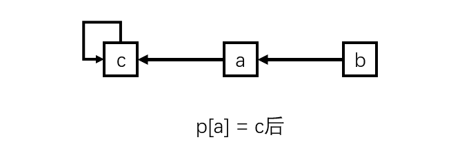
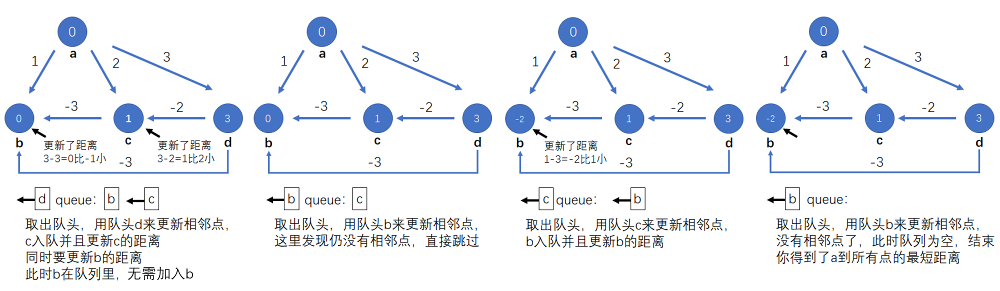

# AlgorithmNotes

## 杂项

### cout防止科学计数法格式

```c++
cout << fixed << setprecision(0) << res << endl; //setprecision的参数决定了最后输出res的小数位有几个，0没有小数位
```

### 结构体+自定义排序

```c++
struct E
{
    int a,b,c;
} e[N];

bool cmp(E e1, E e2) //按b的大小升序排序 b1 < b2 < ... < bn
{
    return e1.b < e2.b;
}
```

### iota函数 

```c++
int p[100];
int n;
cin >> n;
iota(p+1,p+1+n,1); //把p[1]-p[n]赋值为1-n的全排列
//n为5时
for(int i = 0; i <= n + 2; i++) cout << p[i] << ' ';
```

输出：`0 1 2 3 4 5 0 0`

### fill函数

```c++
int p[100];
int n;
cin >> n;
fill(p+1,p+1+n,6); //把p[1]-p[n-1]赋值为 
//n为5时
for(int i = 0; i <= n + 2; i++) cout << p[i] << ' ';
```

输出：`0 6 6 6 6 0 0 0`

与memset相比：

1. 可以赋任何值，而memset只能赋0，-1，0x3f
2. 但是比memset慢

### find函数

```c++
string s = "abcabc";
string s1 = "I'm s1.";
cout << s.find("cab") << endl;

if(s.find("cab") == string::npos) cout << "cannot find \"cab\"" << endl;
else cout << "find \"cab\"" << endl;

if(s.find("cab") == s.npos) cout << "cannot find \"cab\"" << endl;
else cout << "find \"cab\"" << endl;

if(s.find("cab") == s1.npos) cout << "cannot find \"cab\"" << endl;
else cout << "find \"cab\"" << endl;

if(s.find("ccc") == string::npos) cout << "cannot find \"cab\"" << endl;
else cout << "find \"cab\"" << endl;

if(s.find("ccc") == s.npos) cout << "cannot find \"cab\"" << endl;
else cout << "find \"cab\"" << endl;

if(s.find("ccc") == s1.npos) cout << "cannot find \"cab\"" << endl;
else cout << "find \"cab\"" << endl;
```

输出：

```markdown
2
find "cab"
find "cab"
find "cab"
cannot find "cab"
cannot find "cab"
cannot find "cab"
```

1. find函数返回字符串中从左往右第一个出现参数字符串的下标
2. 当find函数找不到参数字符串时会返回string::npos
3. 任意字符串加上`.npos`等价于string::npos


## 基础算法

### 快速排序

#### 算法思路

1. 对于一个区间q[N]，找中间的数k(q[mid])作为基准值
2. 前后两个指针i,j往中间扫描
3. i往后扫描，直到q[i] > k
4. j往前扫描，直到q[j] < k
5. 此时，q[i]比基准值k大，q[j]比基准值k小，交换q[i]和q[j]
6. 重复3、4、5步，直到i和j相遇
7. 此时他们的相遇点左边的元素全部小于基准值k，右边的元素全部大于基准值k
8. 对这两部分区间递归操作前面所有的步骤，递归的终止条件为：当区间内的元素只有一个时，无需排序，即终止条件
9. 排序完成

#### 注意事项（边界问题）

1. 对于上面的第3和第4步操作，无论怎样都应该先移动再判断，否则就会出现死循环的状况：q[i]和基准值k相同时
2. 对于上面这种做法，会跳过首尾元素的判断，所以前后两个指针应先往外退一个，否则，举个例子，当区间是[3,6]时，一开始q[i]是3，q[j]是6，然后直接移动，没有判断，i往后移，j往前移，此时他们相遇过了，交换两者，区间变成了[6,3]，这样就不对了。如果一开始往外退了一个，那么他们先移动，然后判断，之后，i不用移动，j再移动一个，此时i和j相遇，他们对应的值都是3，交不交换都一样，这样才正确
3. i和j每次相遇后，他们可能会相等，可能会i比j大1，两区间如何划分取决于基准值如何取，在这里我选择只用q[l+r>>1]这一种基准值，区间划分时用j和j+1划分，具体分析见[Acwing](https://www.acwing.com/solution/content/16777/)

#### 参考代码

```c++
void quick_sort(int q[], int l, int r)
{
    if(l >= r) return; //终止条件
    int k = q[l + r >> 1], i = l - 1, j = r + 1; //取中间值为基准值，i和j为左右端点往外一格
    while(i < j)
    {
        i++; //不论怎样都先移动，防止后面死循环
        j--;
        while(q[i] < k) i++; //判断并移动
        while(q[j] > k) j--;
        if(i <= j) swap(q[i],q[j]); //移动完后，如果还没相遇就交换
    }
    //while循环结束，标志着两个指针相遇
  	//对两个区间进行递归
    quick_sort(q,l,j);
    quick_sort(q,j+1,r); 
}
```


### 归并排序

#### 算法思路

1. 对于一个区间q，把其分成两半
2. 把分成两半的区间递归操作上面的步骤，递归的终止条件是区间内只有一个数
3. 每次递归把两个区间合并，变成一个有序的区间
   1. 两个区间都是有序的，每次选择两个区间中最小的数放到一个区间内
   2. 每次放完后，因为原来区间是有序的，放完之后的区间仍保持有序
   3. 继续第一步，直到两个区间合并为一个新的有序区间 
4. 递归完后排序完成

#### 注意事项（边界问题）

1. 把区间分为两半，按mid = l + r >> 1（l+r除以2向下取整）来算，第一个区间为[l,mid]，第二个区间为[mid+1,r]

#### 参考代码

```c++
int temp[N]; //临时存放合并的区间
void merge_sort(int q[], int l, int r)
{
    if(l >= r) return; //区间内只有一个数时终止递归
    int mid = l + r >> 1, i = l, j = mid + 1; //把区间分为两半
    merge_sort(q,l,mid); //递归处理两个区间
    merge_sort(q,mid+1,r);
    int k = 1;
    while(i <= mid && j <= r) //合并区间
    {
        if(q[i] <= q[j]) temp[k++] = q[i++];
        else temp[k++] = q[j++];
    }
    while(i <= mid) temp[k++] = q[i++];
    while(j <= r) temp[k++] = q[j++];
    for(int i = l, j = 1; i <= r; i++,j++) q[i] = temp[j]; //把临时合并的区间还给原来的区间
}
```

#### 应用：逆序对的数量

##### 思路

1. 根据归并排序，当递归到最后一层时，每个区间只有一个元素，每两对区间可以直接判断是否为逆序对，返回逆序对的数量
2. 他们合并之后变成了一个有序区间并且和另一个也合并完的有序区间进行逆序对判断，返回逆序对的数量
   1. 对于两个区间[l,mid]和[mid+1,r]，如果第二个区间的一个数q[j]小于第一个区间的数q[i]，因为有序性，i和i后面的数都可以和q[j]组成逆序对
   2. 巧妙地运用了归并排序过程中区间的有序性，在两个区间内元素顺序对判断是否是逆序对无关
3. 层层往上递归，最后得出逆序对的数量

##### 参考代码

```c++
//原题数据范围为1e5，会爆int，所以要开ll
int q[N],temp[N];
ll merge_sort(int l, int r)
{
    if(l >= r) return 0; //区间内只有一个元素时，没法组成逆序对，返回0
    int mid = l + r >> 1, i = l, j = mid + 1;
    ll res = merge_sort(l,mid) + merge_sort(mid+1,r); //记录子区间的逆序对数量
    int k = 1;
    while(i <= mid && j <= r)
    {
        if(q[i] > q[j]) //满足逆序对的情况
        {
            res += mid - i + 1; //加上逆序对的数量
            temp[k++] = q[j++];
        }
        else temp[k++] = q[i++];
    }
    while(i <= mid) temp[k++] = q[i++]; //扫尾
    while(j <= r) temp[k++] = q[j++];
    for(int i = l, j = 1; i <= r; i++,j++) q[i] = temp[j];
    return res; //返回逆序对数量
}
```


###  二分

## 数据结构

### 并查集

#### 算法思路

创建一个p数组，表示i的父节点为p[i]。初始状态每个集合都是独立的，我们设定每个元素的父节点都是他自己，也就是说：

1. p[1] = 1, p[2] = 2,……,p[x] = x
   ```c++
   ioat(p+1,p+1+x,1);
   ```
2. x只属于只有x这一个元素的集合里

对于合并集合操作，比如把a所属的集合和b所属的集合合并时，只需让p[b] = a，根据p的定义来说，即让b的父节点指向a。当我们要查询b是否属于a时，只需要看p[b]是否等于a就行了。当然，我们要看a是否属于a这个集合时，看p[a]是否等于a就行。


但是，我们新建一个c，当我们把a所属的集合和c所属的集合按这个方法合并后：




此时：

1. a、b、c都属于同一个集合里
2. p[b] = a, p[a] = c, p[c] = c 

此时我们要按上面的方法判断b是否属于c这个集合里就不对了，因为p[b]不等于c，但是我们知道p[b] = a，也就是说b的父节点是a；p[a] = c，a的父节点是c。其实b的根节点是c，b是属于c这个集合里的，我们只需要让b循环访问父节点直到访问到c时就可以了

但是，我们新建d和e，当我们把d和e合并，再把e所属的集合和c所属的集合仍按这个方法合并后：


此时：

1. a、b、c、d、e都属于同一个集合里
2. p[b] = a, p[a] = c, p[e] = d, p[d] = c, p[c] = c

此时我们还按上面的方法判断e是否属于b这个集合里， 我们要先知道b和e的根节点，再判断他们的根节点是否相等就可以了

但是，如果只这样做，会出现两个弊端：

1. 我们依次合并1和2,2和3,……,x-1和x，会变成这样的情况：

   

   我们合并完后，他们确实是在同一个集合，但是我们要查询x是否属于1这个集合时，要循环向上遍历x的父节点直到找到1为止 

2. 当我们要查询x和2x是否在同一个集合里时，要查询x和2x的根节点是否一样，要循环向上遍历x和2x的父节点，然后判断两者的父节点是否相同
   

   但是当数据量非常大时，这样查询的时间复杂度是相当大的

所以我们每次合并集合时要做一个路径压缩的操作，它可以：

1. 让x直接指向根节点，即p[x]直接等于根节点的编号
   
2. 在查询a和b是否属于同一集合时直接判断a和b的根节点是否相同（路径压缩后其实根节点就是父节点了）

#### 参考代码

我们定义一个合并集合加路径压缩的操作，它可以让一个元素循环向上遍历它的父节点直到找到他的根节点，并在找到之后让该元素直接指向根节点，即让该元素的父节点直接等于它的根节点，同时在查询时可以以O(1)复杂度直接找到根节点

```c++
 int find(int x) //返回x的根节点
 {
     //p[x] == x 时说明已经为根节点了， p[x] != x 时我们让x的父节点指向x的父节点的根节点，即让p[x]指向p[x]的根节点
     if(p[x] != x) p[x] = find(p[x]); 
     return p[x]; //在上述操作完后，p[x]原本指向的父节点变成了根节点
 }
```

我们在合并a和b这两个集合时：

 ```c++
 void merge(int a, int b)
 {
     p[find(a)] = find(b); //找到a和b的根节点，让a的根节点的父节点指向b的根节点即可完成合并操作
 }
 ```

我们在查询a和b两个集合是否是同一个时：

```c++
bool query(int a, int b)
{
    return find(a) == find(b); //返回a的根节点是否等于b的根节点，是则属于同一集合，反之则不属于同一集合
}
```

#### 应用：连通块中点的数量

##### 思路

我们开一个cnt数组用来记录每个集合的元素数量。显然，一开始每个集合都有一个元素，所以cnt的所有值为1。

假设一开始，我们有a和b两个集合，他们都只有他们本身一个元素。现在使用合并操作p[find(b)] = find(a)把他们合并：

1. a和b现在属于同一个集合
2. a和b这一个集合的元素数量为2

由于合并操作，b的根节点变成了a，所以a和b属于同一集合。在数量操作上，他们的根节点都是a，所以在合并时应该做如下操作：

```c++
cnt[find(a)] += cnt[find(b)];
p[find(b)] = find(a);
```

此时cnt[a]的值变为了2，是由a集合本身就有的一个元素和b集合的一个元素相加而成

由于现在a和b属于同一集合，他们的根节点都相同，要询问a和b所在的集合的元素数量就变成了询问a和b根节点所在的集合的元素数量，即cnt[a]。而现在cnt[b]仍为1，但是cnt[b]已经再也访问不到了，因为b再也不可能作为根节点出现，同时cnt[b]已经失去了意义

##### 注意事项（顺序问题）

1. 要先合并数量，再合并集合，否则已经合并a和b这两个集合后，a和b属于同一集合，cnt[find(a)]和cnt[find(b)]是一样的，相当于把自己的数量和自己的数量合并，而不是合并之前两个集合的数量的合并
   ```c++
   //错误操作
   p[find(b)] = find(a);
   cnt[find(a)] += cnt[find(b)];
   ```

2. 不能合并同一个集合，否则会出现和第一点一样的情况
   ```c++
   if(find(a) != find(b))
   {		
   	cnt[find(a)] += cnt[find(b)];
   	p[find(b)] = find(a);
   }
   ```


### 字符串匹配(KMP)

#### 算法思路 

1. 核心是求next数组，匹配时根据next数组匹配。对于next数组：对于一个长度为n的字符串s，next[i]表示字符串从下标1到下标i即s[1,i]中，最长的公共前后缀长度是多少，如下图，假设最长公共前后缀长度为3
2. 假设我们已经得到了next数组，那么接下来我们就可以匹配了，我们开始遍历一个字符串str，用上面的字符串s匹配
   1. 我们用i指针遍历str，j指针遍历s
      
   2. 每次判断str[i]和s[j+1]是否相同，如果相同j向后一位，否则j移动到next[j]（即对应的最长公共前缀的位置） 
   3. 当j遍历完s时匹配成功
3. 求next数组：跟匹配的原理一样，用s来匹配s，i指针要从下标2开始，因为下标1的next值为0，一个字符不能组成公共前后缀。 每次遍历时next[i]的值即为j的位置
   
4. 具体原理请见[B站视频](https://www.bilibili.com/video/BV1AY4y157yL)和[y总讲解](https://www.acwing.com/video/259/)

#### 参考代码

```c++
int ne[N]; //next数组
char s[N],str[N];
int n,m; //n为s的长度，m为str的长度

void get_next() //得到next数组
{
    for(int i = 2, j = 0; i <= n; i++)
    {
        while(j != 0 && s[i] != s[j+1]) j = ne[j];
        if(s[i] == s[j+1]) j++;
        ne[i] = j;
    }
}

void kmp() //匹配
{
    for(int i = 1, j = 0; i <= m; i++)
    {
        while(j != 0 && str[i] != s[j+1]) j = ne[j];
        if(str[i] == s[j+1]) j++;
        if(j == n) cout << "匹配成功" << endl;
    }
}
```

> 一个人能走的多远不在于他在顺境时能走的多快，而在于他在逆境时多久能找到曾经的自己。	——KMP


## 搜索

### 深度优先搜索(DFS)

#### 算法思路

使用一个递归函数层层往下找答案，然后回溯。要弄清楚dfs函数的参数具体是什么意思。适用于全局搜索

#### 参考模板

##### 常规搜索 

```c++
void dfs(int x) //参数，根据题目含义赋予意义
{
    if(x == n) //只要是递归总会有停止条件，这里是dfs到了最后一层
    {	
        cout << res << endl; //输出答案
        return;
    }
   	st[a] = true; //标记状态
    dfs(x + 1); //继续往下dfs
    st[a] = false; //回溯状态
}
```

##### 图论搜索

```c++
const int N = 1e5 + 10, M = N * 2; //这里例举树的dfs，采用无向图

void add(int a, int b) //无向图的只需要建两条边即可
{
    e[idx] = b;
    ne[idx] = h[a];
    h[a] = idx++;
    swap(a,b);
    e[idx] = b;
    ne[idx] = h[a];
    h[a] = idx++;
}

boot st[N]; //记录是否已经被遍历过

void dfs(int u)	
{
    st[u] = true; //标记被遍历过了
    for(int i = h[u]; i != -1; i = ne[i])
    {
        int j = e[i];
        if(st[j]) continue;
        dfs(j);
    }
}
```

#### 应用：排列数字

```c++
int path[N]; //记录数字
bool st[N]; //记录哪个数字被用过了
int n; //一共需要全排列n个数字

void dfs(int u) //表示搜索到了第u个数字
{
    if(u == n) //搜到了第n层，此时排列好了，停止继续往下搜索，输出答案，接着会回溯到上一层
    {
        for(int i = 1; i <= n; i++) cout << path[i] << ' ';
        cout << endl;
        return;
    }
    for(int i = 1; i <= n; i++) //枚举每个数字
    {
		if(st[i]) continue; //如果数字被用过了就跳过
        st[i] = true; //否则就用这个数字并且标记被用过了
       	path[u+1] = i;
        dfs(u+1); //往下搜一层
        st[i] = false; //回溯操作
    }
}
```


### 宽度优先搜索(BFS)

#### 算法思路

创建一个队列，首先把起点加入队列，然后循环以下操作：

1. 取出队头
2. 用队头更新元素，把新元素加入队列

直到队列为空，此时已经遍历完所有的元素，可以求得一个最短的属性

#### 参考模板

##### 常规搜索

```c++
void bfs()
{
	queue<int> q; //创建一个队列并且把起点加入队列
    q.push(1);
    
    while(q.size()) //只要队列不空就一直搜索直到队列为空
    {
        int t = q.front(); //取出对头
        q.pop;
        
        //这边写：
		//用t这个队头来获得新元素的代码的具体逻辑
        //最后把新元素加入队列
        
    }
}
```

##### 图论搜索

```c++
void bfs(int u) //以u为起点bfs
{
    queue<int> q;
    q.push(u);
    st[u] = true;
    while(q.size())
    {
		auto t = q.front();
        q.pop();
        cout << t << ' ';
        for(int i = h[t]; i != -1; i = ne[i])
        {
            int j = e[i];
            if(st[j]) continue;
            st[j] = true;
            q.push(j);
        }
    }
}
```

#### 应用：排列数字

 ```c++
 int n; //排列数字的数量
 
 void bfs()
 {
 	queue<string> q; 
     q.push(""); //加入起点，一开始字符串为空
     
     while(q.size())
     {
         string t = q.front();
         q.pop();
         
         if(t.size() == n) //出现了全排列就输出，并且不用继续往后搜索
         {
 			cout << t << endl;
             continue;
         }
         
         for(int i = 1; i <= n; i++) //枚举每个数字
         {
             if(t.find(i + '0') != t.npos) continue; //如果出现了已经出现过的数字，那就跳过
             string temp = t;
             temp.push_back(i + '0'); 
             q.push(temp); //新添没有加入过的数字，并加入到队列中
         }
     }
 }
 ```


## 最短路径算法


### 迪杰斯特拉(Dijkstra)

#### 算法思路

1. （单源最短路，找的是一个点到其他点的最短距离，接下来都以1为起点。）创建一个dist数组，用来存1到各个点最短路径的距离（初始状态全为无穷大，即1到所有点的距离为无穷大）；创建一个bool类型的st数组，用来判断一个点是否已确定1到该点的最短距离（初始状态全为false，即都没有确定最短距离）。当然需要一个存各个点之间的距离的空间，稠密图用邻接矩阵，稀疏图用邻接表
2. 算法步骤主要是一个循环：
   1. 找出未标记的距离最短的点
   2. 标记距离最短的点
   3. 用这个点更新到其他点的距离
   4. 重复123，直到所有点被确认了1到该点的最短距离
3. 第一步很特殊，我们要算1到其他点的距离，此时1到1的距离最短，为0，我们在dist数组给1赋值为0；并且没有其他点到1的距离比1到1的距离更短，我们在st数组给1赋值为true即1已经确定最短距离
4. 此时我们已经做了 *<u>1.找出未标记的距离最短的点</u>* 和 *<u>2.标记距离最短的点</u>*。接下来我们要  *<u>3.用这个点更新到其他点的距离</u>*，即用1更新1到其他点的距离
5. 更新完后，我们又要 *<u>1.找出未标记的距离最短的点</u>* 了，我们在刚才用1更新的所有点中，*<u>1.找出未标记的距离最短的点</u>* 并且 *<u>2.标记距离最短的点</u>* 接着 *<u>3.用这个点更新到其他点的距离</u>*，如此往复，*<u>直到所有点被确认了1到该点的最短距离</u>*。
6. 该算法基于贪心思想，可以证明在这样操作后一定能得出1到所有点的最短距离

#### 朴素版

朴素版时间复杂度和空间复杂度都很高，所以仅适用于数据范围较小的稠密图

##### 参考代码

```c++
int g[N][N]; //邻接矩阵，主函数里要初始化为0x3f3f3f3f
int dist[N]; 
bool st[N];

int dijkstra(int l, int r) //返回从l到r的最短距离
{
    memset(dist,0x3f,sizeof dist);
    dist[l] = 0;
    
    for(int i = 1; i <= n; i++)	
    {
        int t = -1;
        //1.找出未标记的距离最短的点
        for(int j = 1; j <= n; j++)	
        {
            if(!st[j] && (t == -1 || dist[j] < dist[t]))
            {
                t = j;
            }
        }
        //2.标记距离最短的点
        st[t] = true;
        //3.用这个点更新到其他点的距离
        for(int j = 1; j <= n; j++)
        {
            dist[j] = min(dist[j],dist[t] + g[t][j]);
        }
    }
    return dist[r];
}
```

#### 堆优化版

1. 朴素版每次更新距离时不管两点之间是否有边，都要做min操作，这是没有意义的。所以我们进行存储优化：使用邻接表，每次只需更新相邻的点而无需更新所有的点，减少复杂度

2. 朴素版每次找出未标记的距离最短的点也很麻烦，要遍历所有未标记的点来找出最小值。所以我们使用一个数据结构：小根堆来储存，每次都可以以O(1)的复杂度直接得到未标记的距离最短的点；我们添加未标记的距离最短的点时，复杂度为O(logn)

3. 在使用堆优化后，我们可以把去掉朴素版中没有意义的操作与存储，且把复杂度降低到了O(nlogn)

##### 参考代码

```c++
#define x first
#define y second
typedef pair<int,int> PII;
int h[N],e[N],w[N],ne[N],idx = 0; //邻接表，主函数里需要把h初始化为-1
int dist[N];
int n,m;
bool st[N];
priority_queue<PII,vector<PII>,greater<PII>> heap; 

void add(int a,int b,int c) //建一条a指向b权重为c的边
{
    e[idx] = b;
    w[idx] = c;
    ne[idx] = h[a];
    h[a] = idx++;
}

int dijkstra(int l, int r) //返回l到r的最短距离
{
    memset(dist,0x3f,sizeof dist);
    dist[l] = 0; //添加l
    heap.push({0,l}); //把l加入到小根堆中，l到l的距离为0
    
    while(heap.size())	
    {
        //t.x表示1号点到t.y的距离 t.y表示点的编号
        auto t = heap.top();
        heap.pop();
        //标记t.y
        if(st[t.y]) continue;
        st[t.y] = true;
        for(int i = h[t.y]; i != -1; i = ne[i])
        {
            int j = e[i]; //j表示与t.y相邻的点
            if(dist[j] > dist[t.y] + w[i])
            {
                dist[j] = dist[t.y] + w[i];
                heap.push({dist[j],j});
            }	
        }
    }
    return dist[r];
}
```

#### 图解


### Bellman-ford

#### 算法思路	

我们“松弛”所有边，一共松弛k次，因为一条边是有两个端点的， 松弛后会更新起点到后端点的距离。最后可以求出从l到r最多经过 k 条边的最短距离

在松弛一条由a指向b的边时，取起点到a的距离加上a到b的边的权重和起点到b的距离的最小值


在每一次松弛时，需要备份状态，防止串联


#### 参考代码
```c++
const int M = 510, N = 1e5 + 10;

struct edge	
{
	int a,b,w;
} e[N]; //存a到b的边，距离为w。此外，采用邻接矩阵，pair或元组等存储结构都可以

int n,m,k; 
int dist[M],temp[M]; //temp存备份

int bellman_ford(int l, int r)
{
    memset(dist,0x3f,sizeof dist);
    dist[l] = 0;
    for(int i = 1; i <= k; i++)
    {
        //备份
        memcpy(temp,dist,sizeof dist);
        //遍历所有边，并松弛
        for(int j = 1; j <= m; j++)
        {
            int a = e[j].a, b = e[j].b, w = e[j].w;
            dist[b] = min(dist[b],temp[a] + w);
        }
    }	
    return dist[r];
    //在判断能否到达时，要判断dist[r] > 0x3f3f3f3f / 2 而不是 dist[r] == 0x3f3f3f3f
    //因为在每次松弛时，每个点的距离虽然被减小了或者增加了，但是它的距离的本质还应该是无穷，但是已经不是0x3f3f3f3f了
    //所以要判断是否大于0x3f3f3f3f / 2，因为数据范围不会让你减小的总值大于0x3f3f3f3f的一半
}
```


### spfa

#### 算法思路

spfa是由bellman-ford算法优化而来的，对于bellman-ford而言，每次都要把所有的边都松弛，其中一些边是没有必要松弛的，会浪费时间。spfa对此做了优化：

1. 从起点开始更新，把和起点相邻的点放入队列中，并更新距离
2. 使用bfs，用队列中每个点来更新该点的相邻点的距离
3. 在bfs时，已经在队列中的点无需入列
4. 当队列为空时，spfa结束

#### 参考代码

spfa和dijkstra的堆优化版本使用的数据结构是一样的，即都是用邻接表来存储

```c++
int dist[N];
bool st[N];
int spfa(int l, int r)
{
    memset(dist,0x3f,sizeof dist);
    dist[l] = 0;
    queue<int> q;
    q.push(l);
    st[l] = true;
    
    while(q.size())
    {
   		int t = q.front();
        q.pop();
        //出队并标记 
        st[t] = false;	
        for(int i = h[t]; i != -1; i = ne[i])
        {
            int j = e[i];
            if(dist[j] > dist[t] + w[i])
            {
                dist[j] = dist[t] + w[i];
                //如果不在队列中才加入
                if(!st[j])
                {
                    q.push(j);
                    //已加入，标记入队
                    st[j] = true;
                }
            }
        }
    }
    
    return dist[r]; 
    //与bellman-ford算法不一样，仍然是判断是否等于0x3f3f3f3f
    //因为spfa把所有点的距离都更新了，如果不能到r点的话dist[r]必为0x3f3f3f3f
}
```

#### 图解




#### 应用：spfa判断负环

##### 思路

基于：抽屉原理

使用cnt数组来记录某个点到每个点的最长路径长度。一开始把所有的点都加入到队列中，然后开始使用spfa算法，在取出队头元素后，他的相邻点的cnt值等于队头元素的cnt值+1，因为要多走一条边。


如果存在一个负权边，如下图


我们在spfa时，会把队头b取出，然后你会发现dist[b] > dist[b] + w[i]，即再绕一圈这个负环后距离会更小，接着你又把b加入进队列，cnt[b]++。

然后你就会如此往复，cnt会变得无穷大，很显然这就存在一个负环了。但是我们肯定不能判断是否是无穷大，这样会TLE。所以我们根据抽屉原理：就拿上图举例，一共有三个点，如果没有负环应该只有两条边，但是现在有三条边，两条边要放到非负环的抽屉里，还剩下一个负环的边放不进抽屉里；如果有n个点，在没有负环的情况下cnt最大值为n-1，一旦cnt出现了n，那么必定存在负环。

##### 参考代码

我们只需要在更新距离时，更新cnt，一旦发现cnt大于等于n，那么就存在负环，可以直接结束函数

我们无需判断一个点是否能到达另一个点，所以dist数组为初始状态0就够了 

```c++
int n,m;
int dist[N];
int cnt[N];
bool st[N];

bool spfa() //返回是否存在负环
{ 
    queue<int> q;
    for(int i = 1; i <= n; i++) 
    {
        q.push(i);
        st[i] = true;
    }
  	
    while(q.size())
    {
        int t = q.front();
        q.pop();
        st[t] = false;
        
        for(int i = h[t]; i != -1; i = ne[i])
        {
            int j = e[i];
            if(dist[j] > dist[t] + w[i])
            {
                dist[j] = dist[t] + w[i];
                cnt[j] = cnt[t] + 1;
                if(cnt[j] >= n) return true; //不能写==
                if(!st[j])
                {
                    q.push(j);
                    st[j] = true;
                }
            }
        }
    }
    return false;
}
```


### Floyd

##### 算法思路

使用邻接矩阵，基于动态规划，具体原理见动态规划

##### 参考代码

```c++
int d[N][N]; //邻接矩阵 
int n; //代表有几个点
void floyd()
{
    for(int k = 1; k <= n; k++)
        for(int i = 1; i <= n; i++)
            for(int j = 1; j <= n; j++)
                d[i][j] = min(d[i][j], d[i][k] + d[k][j]);
}
```


## 最小生成树


### Prim

#### 算法思路

回顾一下朴素版dijkstra的步骤：

1. 找出未标记的距离最短的点
2. 标记距离最短的点
3. 用这个点更新到其他点的距离

对于Prim，我们把dist数组定义为每个未标记的点到最小生成树的最短距离，把st数组定义为是否已经被标记为加入最小生成树中的状态，然后我们照着上面的葫芦画瓢：

1. 找出未标记的距离最短的点
2. 标记距离最短的点
3. 用这个点更新未标记的点到已经确认的最小生成树的最短距离

同样，对于堆优化版也可以相应地修改

#### 注意事项（孤立点问题）

在dijkstra中，如果最后一个点的dist距离为无穷，那么说明无法到达该点。

那么在Prim中，如果一个点的dist距离为无穷，那么说明它和这个树没有连接起来，就没有最小生成树了。

#### 参考代码

只需要在朴素版dijkstra的代码上稍作修改就可以了

```c++
int g[N][N]; //邻接矩阵，存边
int dist[N]; //存每个点到已确定的最小生成树的最短距离
bool st[N]; //每个点是否已经加入到最小生成树中

int Prim() //输出最小生成树的总边权重,不存在输出impossible
{
    memset(dist,0x3f,sizeof dist);
    
    dist[1] = 0; //一开始把任意一个点加入到树中
    int res = 0; //总边权重
    
    for(int i = 1; i <= n; i++)	//一共操作n次，基于贪心
    {
        int t = -1;
        //1.找出未标记的距离最短的点
        for(int j = 1; j <= n; j++)
        {
            if(!st[j] && (t == -1 || dist[j] < dist[t]))
            {
                t = j;
            }
        }
        //2.标记距离最短的点
        st[t] = true;
    
        //t加入到了树中，把权重累加到res上
        res += dist[t];
        //孤立点问题
        if(dist[t] == 0x3f3f3f3f) 
        {
            cout << "impossible";
            return; 
        }
    
        //3.用这个点更新未标记的点到已经确认的最小生成树的最短距离
        for(int j = 1; j <= n; j++)
        {
    		if(!st[j] && dist[j] > g[t][j])
                dist[j] = g[t][j]; //这里是点到树（一个集合），而不是起点到点
                //该处dijkstra是取min(dist[j],dist[t] + g[t][j])，因为dist的意义不同
        }
    }
    
    return res;
}
```

同样，堆优化版只需要改一改就行了

```c++
#define x first
#define y second
typedef pair<int,int> PII;
int h[N],e[N],w[N],ne[N],idx = 0; 
int dist[N];
int n,m;
bool st[N];
priority_queue<PII,vector<PII>,greater<PII>> heap; 

void Prim() //输出最小生成树的总边权重,不存在输出impossible
{
    memset(dist,0x3f,sizeof dist);
    dist[1] = 0;
    heap.push({0,1}); 
    int res = 0;
    while(heap.size())	
    {
        //t.x表示t.y号点到已知的最小生成树的距离 t.y表示点的编号
       	//1.找出未标记的距离最短的点
        auto t = heap.top();
        heap.pop();
        //2.标记距离最短的点
        if(st[t.y]) continue;
        st[t.y] = true;
        //3.用这个点更新未标记的点到已经确认的最小生成树的最短距离
        for(int i = h[t.y]; i != -1; i = ne[i])
        {
            int j = e[i]; 
            if(dist[j] > w[i])
            {
                dist[j] = w[i];
                heap.push({dist[j],j});
            }	
        }
    }
    for(int i = 1; i <= n; i++) //如果有一个点没有被遍历到，说明他是一个孤立点，不存在最小生成树
    {
        if(!st[i])
        {
            cout << "impossible";
            return;
        }
    }
    cout << res; //存在，返回最小生成树的总权重 
}
```


### Kruskal

#### 算法思路

把所有的边按权重大小升序排序，接着枚举所有的边，然后我们对所有的点使用并查集：

1. 对于每一个a和b之间的边，权重为w。

2. 如果a和b不在同一集合： 
   1. 合并a和b
   2. a和b之间的边变为最小生成树的一个路径
   3. 最小生成树的总权重加w
3. 使用一个cnt记录一共合并了几次，若一共有n个点，cnt应该为n-1次，即n-1条边，否则不存在最小生成树，因为有一个孤立点

最后所有点都合并成了一个集合，与所有每次合并时的边组成了最小生成树，搭配下面的图解更易于理解

#### 参考代码

```c++
struct E //存边
{
    int a,b,w;
} e[N];

bool cmp(E e1, E e2) //自定义排序，按权重大小升序排序
{
    return e1.w < e2.w;
}

int Kruskal()
{
    int res = 0; //总权重
    int cnt = 0; //记录合并了几次，即一共几条边
    for(int i = 1; i <= m; i++)
    {
        int a = e[i].a, b = e[i].b, w = e[i].w;
        a = find(a), b = find(b);
        if(a != b)
        {
            p[a] = b; //合并
            res += w; //加给总权重
            cnt++; //加一条边
        }
    }
    if(cnt < n - 1) return -1; //边少于n-1则不能构成最小生成树
    else return res;
}
```

#### 图解


## 二分图


### 染色法判定二分图

#### 算法思路

基于理论：”一个图是二分图“是“图中不含奇数环”的充要条件


我们使用dfs来实现，我们定义一个color数组，0表示未染色，1表示一种颜色，2表示另一种颜色

我们在dfs时：

1. 该点未染色，染一种颜色，继续往下dfs
2. 该点染了一种颜色，遍历邻点，如果邻点：
   1. 未染色，染另一种颜色，继续dfs
   2. 染了同种颜色，不满足题意，不是二分图
   3. 染了另一种颜色，目前满足题意，可能为二分图

在染不同色时，比如现在为1，要染成2，只需用3减去1，现在为2同理，用3减去2

不能只dfs一次，如果我们有两个子图，只能遍历完一个子图，即只能判断一个子图是否是二分图


#### 参考代码

```c++
int color[N];
bool flag = true;
void dfs(int u, int c) //把u号点颜色染为c
{
	color[u] = c;
    for(int i = h[u]; i != -1; i = ne[i])
    {
		int j = e[i];
        //在染不同色时，比如现在为1，要染成2，只需用3减去1，现在为2同理，用3减去2
        if(color[j] == 0) dfs(j,3 - c); //1.未染色，染另一种颜色，继续dfs
        else if(color[j] == c) flag = false; //2.染了同种颜色，不满足题意，不是二分图
        else if(color[j] == 3 - c) continue; //3.染了另一种颜色，目前满足题意，可能为二分图
    }
}
int main()
{
	//...
    for(int i = 1; i <= n; i++)
    {
        //不能只dfs一次，如果我们有两个子图，只能遍历完一个子图，即只能判断一个子图是否是二分图
        if(!color[i]) dfs(i,1);
    }
    if(flag) cout << "Yes" << endl;
    else cout << "No" << endl; 
}
```

​	

### 二分图的最大匹配

#### 算法思路

一个图分成左子图和右子图，现要找该二分图的最大匹配数，我们定义match数组为右子图的点匹配的左子图的哪个点

我们遍历左子图，每次遍历左子图的一个点a时： 

1. 遍历a在右子图的所有点
2. 遍历到了点b，如果b没有被遍历过：
   1. 如果b没有被匹配过，则b匹配a
   2. 如果b被匹配过，我们在左子图找匹配b的点c，给c重新在右子图匹配一个
   3. 匹配数量加一

```c++
int match[N]; //初始为0，表示还没有匹配
bool st[N]; //临时预定数组，st[b]=a表示一轮模拟匹配中，右子图的b被左子图的a匹配了。

bool find(int u)
{
    for(int i = h[u]; i != -1; i = ne[i]) //遍历u在右子图的所有点
    {
		int j = e[i];
        if(!st[j]) //遍历到了点j，如果j没有被遍历过
        {
            st[j] = true; //标记已遍历
            //1. 如果j没有被匹配过，则j匹配u
			//2. 如果j被匹配过，我们在左子图找匹配j的点c，给c重新在右子图匹配一个
            if(!match[j] || find(match[j]))
            {
                match[j] = u;
                return true;
            }
        }
    }
    return false;
}

int main()
{
    //...
    int res = 0; //最大匹配数
    for(int i = 1; i <= n1; i++) //遍历左子图，一共n1个点
    {
        memset(st,false,sizeof st); //因为每次模拟匹配的预定情况都是不一样的所以每轮模拟都要初始化
        if(find(i)) res++; //匹配数量加一
    }
    cout << res;
}
```


## 数论

### 判断质数

#### 算法思路

判断n是否是质数，最初我们可以枚举$2≤i≤n-1$，判断n是否能被i整除，这样做的时间复杂度O(N)

我们可以优化一下：只需要枚举$2≤i≤\sqrt{n}$，因为在$i$小于$\sqrt{n}$时，如果$i$能被整除，那么其对应了一个大于$\sqrt{n}$的数，即$n/i$；当我们枚举到$n/i$时又要对应到$i$，这无疑枚举了两次，是没有必要的

#### 注意事项（根号问题）

1. 不能使用sqrt函数，sqrt时间复杂度不低，for循环每次调用时会拖慢时间
2. 不能使用$i * i ≤ n$，在$i$接近int或者long long的值时，会溢出

#### 参考代码

```c++
bool isPrime(int n) //返回是否是质数
{
    if(n < 2) return false; 
	for(int i = 2; i <= n / i; i++)
        if(n % i == 0) return false;
    return true;
}
```


### 分解质因数

#### 算法思路

原理：每个正整数都能够以唯一的方式表示成它的质因数的乘积

从最小的质数2开始往后枚举，每次枚举只要能被n整除，就把n除到不能除为止，除了几次这个除数就被分解了几次，接着往后枚举。可以保证能被n整除的只有质数。同样，和判断质数的算法一样，我们只需要枚举到$\sqrt{n}$就行了，并且保证在$\sqrt{n}$之后最多只有一个质因数，如果有两个的话，他们的乘积大于n，就不对了

#### 参考代码

```c++
void divide(int n) //输出n的质因数和该质因数的数量
{
	for(int i = 2; i <= n / i; i++)
    {
        if(n % i == 0)
        {
            int s = 0;
            while(n % i == 0)
            {
               	n /= i;
                s++;
            }
        	cout << i << " " << s << endl;
        }
    }
    if(n > 1) cout << n << ' ' << 1 << endl;
}
```


### 筛质数

#### 算法思路

##### 埃式筛法

从第一个质数开始枚举，每次枚举都把该质数的倍数给标记一下，被标记的数不可能是质数，之后继续枚举没有被标记的数。最后没有被标记的数就是质数


##### 线性筛法

从第一个数开始枚举， 同上，判断该数没有被标记，没有则是质数。接着，枚举小于该数的所有质数，枚举到该数的最小质因数时停止枚举，继续枚举下一个数。这样做可以防止枚举相同的合数。详情参考[AcWing 868. 线性筛法的简单举例分析与证明 - AcWing](https://www.acwing.com/solution/content/100707/)

#### 参考代码

##### 埃式筛法

```c++
bool st[N];
vector<int> get_primes(int n)
{
   	vector<int> res;
    for(int i = 2; i <= n; i++)
    {
        if(!st[i])
        {
            res.push_back(i);
            for(int j = i + i; j <= n; j += i) st[j] = true; //枚举倍数
        }
    }
    return res;
}
```

##### 线性筛法

```c++
bool st[N];
vector<int> get_primes(int n)
{
   	vector<int> primes;
    for(int i = 2; i <= n; i++)
    {
        if(!st[i]) primes.push_back(i);
		for(int j = 0; primes[j] <= n / i; j++)
		{
		    st[primes[j] * i] = true;
		    if(i % primes[j] == 0) break;
		}
    }
    return primes;
}
```


### 求约数

#### 算法思路

和判断质数的优化一样，只需要枚举1到$\sqrt{n}$就行了。注意$\sqrt{n}$是约数时只算一个

#### 参考代码

```c++
vector<int> get_divisors(int n) //获取n的所有约数
{
    vector<int> res;
    for(int i = 1; i <= n / i; i++)
    {
        if(n % i == 0)
        {
            res.push_back(i);
            if(i != n / i) res.push_back(n / i);
        }
    }
    sort(res.begin(), res.end());
    return res;
}
```


### 求约数个数

#### 算法思路

原理：一个数的约数是由这个数的几个质因子相乘得到的

由n个数的乘积组成一个数的约数个数，可以统计这n个数的总质因子的数量来求得这个数的约数个数。详情见[AcWing 870. 约数个数](https://www.acwing.com/solution/content/148964/)

#### 参考代码

```c++
unordered_map<int,int> m;
void get_approximate_numbers(int n)
{
    for(int i = 2; i <= n / i; i++)
    {
        while(n % i == 0)
        {
            m[i]++;
            n /= i;
        }
    }
    if(n > 1) m[n]++;
}

int main()
{
    //把这n个数的质因子都通过get_approximate_numbers函数加起来，然后通过map求和
    int res = 1;
    for(auto [x,y] : m) res *= y + 1;
}
```


### 求约数的和

#### 算法思路

原理：

如果$N=p_1^{c1}*p_2^{c2}*...*p_k^{ck}$，其中p为质因数，c为质因数的次数

N的约数的个数为：$(c_1+1)*(c2+1)*...*(ck+1)$

N的约数的和为：$(p_1^0+p_1^1+...+p_1^{c_1})*(p_2^0+p_2^1+...+p_2^{c_2})*...*(p_k^0+p_k^1+...+p_k^{c_k})$

例如：

分解72的质因数，得$72=2^3*3^2$

72的约数有 $(3+1)*(2+1)=12$ 个，即：

|       | $2^0$ | $2^1$ | $2^2$ | $2^3$ |
| ----- | ----- | ----- | ----- | ----- |
| $3^0$ | 1     | 2     | 4     | 8     |
| $3^1$ | 3     | 6     | 12    | 24    |
| $3^2$ | 9     | 18    | 36    | 72    |

72的约数的和为$(1+2+4+8)*(1+3+9)=195$，即$1*(1+3+9)+2*(1+3+9)+4*(1+3+9)+8*(1+3+9)=195$，195其实就是上表中所有数的和

所以先求出约数的个数然后求约数和就行了

通过秦九韶算法来求$p^0+p^1+...+p^{c}$，初始化和为t=1，接着每一步t都乘p后加1

+ 第一次可以得到$t=p+1$
+ 第二次可以得到$t=p^2+p+1$
+ 第三次可以得到$t=p^3+p^2+p+1$
+ 第 c 次可以得到$t=p^c+...+p^2+p+1$，即$p^0+p^1+...+p^{c}$

#### 参考代码

```c++
unordered_map<int,int> m; //已经求好约数个数的map

int get_sum()
{
    int res = 1;
	for(auto [x,y] : m)
    {
        int t = 1;
        while(y--) t = t * x + 1;
        res = res * t;
    }
    return res;
}
```


### 最大公约数（gcd）

#### 算法思路

原理：

$gcd(a,b)=gcd(a,ka+b)$，其中$a,b,k$都是自然数

比如： $gcd(78,14)=gcd(14,78)=gcd(14,5*14+8)=gcd(14,8)=gcd(8,14)=gcd(8,1*8+6)=...=gcd(2,0)$，当后面出现0时，前面的数就是最大公约数了

也可以直接使用内置函数`__gcd(int a, int b)`

#### 参考代码

手写gcd

```c++
int gcd(int a, int b)
{
	return (b == 0 ? a : gcd(b, a % b));
}
```

源码

```c++
__gcd(_EuclideanRingElement __m, _EuclideanRingElement __n)
{
    while (__n != 0)
    {
        _EuclideanRingElement __t = __m % __n;
        __m = __n;
        __n = __t;
    }
    return __m;
}
```


### 快速幂

#### 算法思路

把$a^k$按k的二进制拆分，比如$a^{21}=a^{2^0}*a^{2^2}*a^{2^4}$，因为21的二进制表示为10101，即$21=2^0+2^2+2^4$

#### 参考代码

```c++
ll qmi(ll a, ll k, ll p) //求a的k次方模p
{
   ll res = 1;
   while(k) 
   {
       if(k & 1) res = res * a % p; //如果k的二进制一位为1，那就把预处理好的a次方乘入答案
       k >>= 1; //k的二进制右移一位
       a = a * a % p; //预处理下一个a的次方
   }
    return res;
}
```


### 求组合数

#### 算法思路

原理：$C_a^b=C_{a-1}^{b-1}+C_{a-1}^b$

#### 参考代码

```c++
int c[N][N];
void init()
{
	for(int i = 0; i < N; i++)
        for(int j = 0; j <= i; j++)
            if(j == 0) c[i][j] = 1;
    		else c[i][j] = c[i-1][j-1] + c[i-1][j];
}
```


### 博弈论

#### Nim游戏

##### 算法思路

如果初始状态为${x_1}\oplus{x_2}\oplus...\oplus{x_n}\neq0$，那么先手一定能操作一次使${x_1}\oplus{x_2}\oplus...\oplus{x_n}=0$，此时后手无论怎么操作后，到先手时先手都可以使${x_1}\oplus{x_2}\oplus...\oplus{x_n}=0$，当x全为0时，后手输了。所以${x_1}\oplus{x_2}\oplus...\oplus{x_n}\neq0$时先手必胜	

反之，如果初始状态为${x_1}\oplus{x_2}\oplus...\oplus{x_n}=0$，那么先手必败

##### 参考代码

```c++
int x[N];
bool win()
{
    int res = 0;
    for(int i = 1; i <= n; i++) res ^= x[i];
    return res; //0则输，否则赢
}
```


## 动态规划


### 注意事项

开始进行状态转移前，要对状态进行初始化，这一步需要视题目而论

---

***Made By KyLen***

​	   
